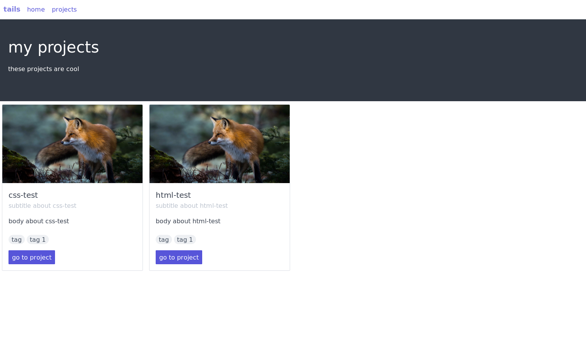

# tails 🦊

`tails` enables you to view, edit, and organize all your javascript projects in one place. currently *pre-alpha*

if you're like me, you're tired of repeating the same boilerplate when creating spas, mpas, or just regular js apps. it also gets quite repetitive just to start an app: cd in a project subdirectory, lookup the start command, start the app, find the port, open the browser, and navigate to it. stuff like hot and auto reload don't come out of the box and have to be set up _every single time_. even if its just a few steps, it's quite monotonous. create-react-app, vue-cli, and the similar help out with *some* boilerplate, but the issue still persists. websites such as jsfiddle and codesandbox solve some issues, but the main drawback is that you must use the website code editor, rather than a normal one. also, your code is in a little iframe in the corner of the screen. inspecting element with iframes doesn't really work like the way you want it. also, your projects are not tracked by any vcs and they are not stored on your computer. tails alleviates all these problems by allowing you to create, view, edit, and launch, your projects all in one place. creating projects via managed presets removes nearly all boilerplate code so you can just experiment with what you want to.

## goals

- main idea: paas for running *trusted* code (small-medium-sized codebases)
- use your standard ide tools to edit these projects
- view projects directly in browser
- browse through, label, sort, and manage all your javascript projects within the web interface
- start projects on demand, *quickly*
- have nice urls during development (no localhost and port crap, all managed for you)

## details

- proposed project types
  - web (static files)
  - spa (parcel, webpack, or rollup bundlers)
  - node
  - node + spa (parcel, webpack, or rollup bundlers)
  - deno
- ability to 'upgrade' web projects
  - ex. 'upgrade' web (static files) to node (importing `express` or `server-static`, etc.)
    - this copies rather than edits to prevent mistakes in upgrade process
  - ex. 'upgrade' (we w/ webpack bundler) + node to out-of-tails-project (since projects shouldn't inherently be tightly coupled to tails)
- the `projects` directory
  - flat tree structure of projects
- showing stdout / stderr
  - maybe have cli so we can just output crap in an existing pty
    - only for running it for testing it out (not for during development, since we have vscode console for that)
- linting / style formatting
  - option to have no linting or style formatting (meaning, the editor does everything)
  - or option to have prettier, eslint configs symlinked to project directory and have watch optiosn for auto update
  - or have combo wombo or something
- show generated metadata
  - how much browser support your website has
  - size of codebase gzipped, minified, etc.

### code

microservices architecture. for now, since are in early stages, we will docker compose a swarm until i reconfig later for a more k8-native dev workflow

- `manager`
  - what 'tails clients' interfaces with. right now this basically performs db ops and launches stuff like vscode
- dashboards that are frontends to `./manager`. if you want to hack around, the goal is to make it super easy to create your own interface around the manager `./manager` microservice
  - dashboard-mpa'
    - express-migrating-to-koa node mpa w/ spectrecss styling. basic
  - dashboard-spa
    - svelte spa (including server-side code) w/ tailwindcss styling. to-be-more sophisticated replacement for the mpa
  - projects
    - actual projects
  - temp server that serves all the projects in `projects`. for now serves static files for html, css, js projects

### development

- open any mount of subprojecs at once without conflicts
  - containerization of non web (static) sites (idk maybe not actually)
- nice domains during development
- cli?

### production

- choose which projects to deploy
- web page lists projects
- even those most of these are (probably) going to be throwaway test projects, would be cool to select and choose which ones go to prod and only have those deployed and visible in some sort of listing
